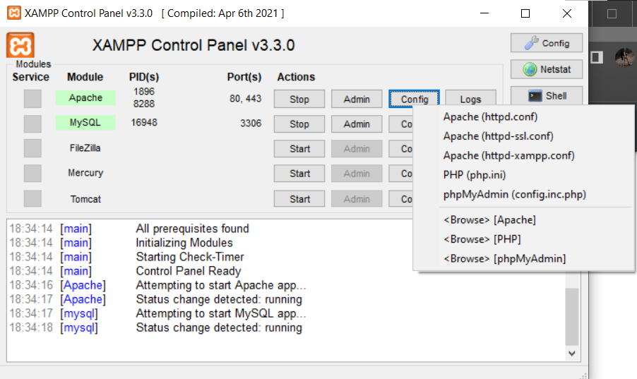
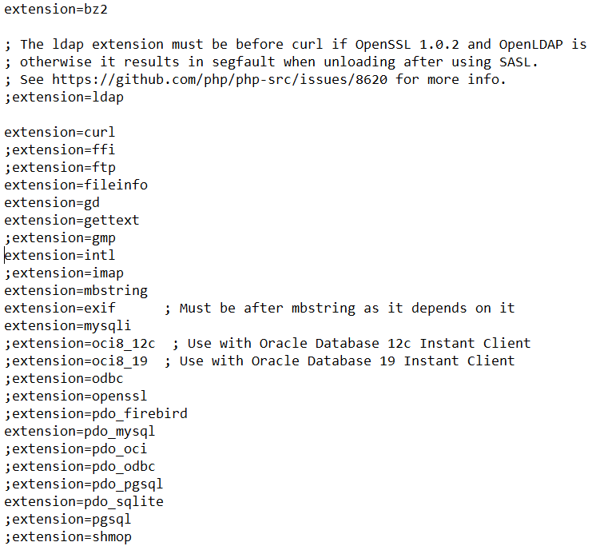
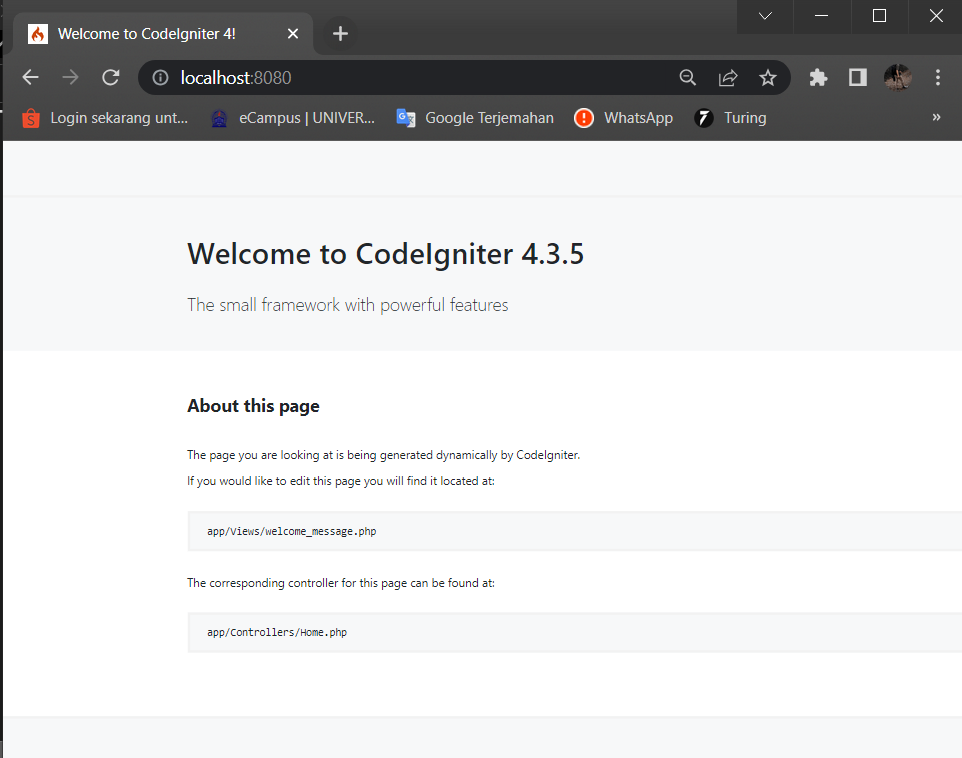
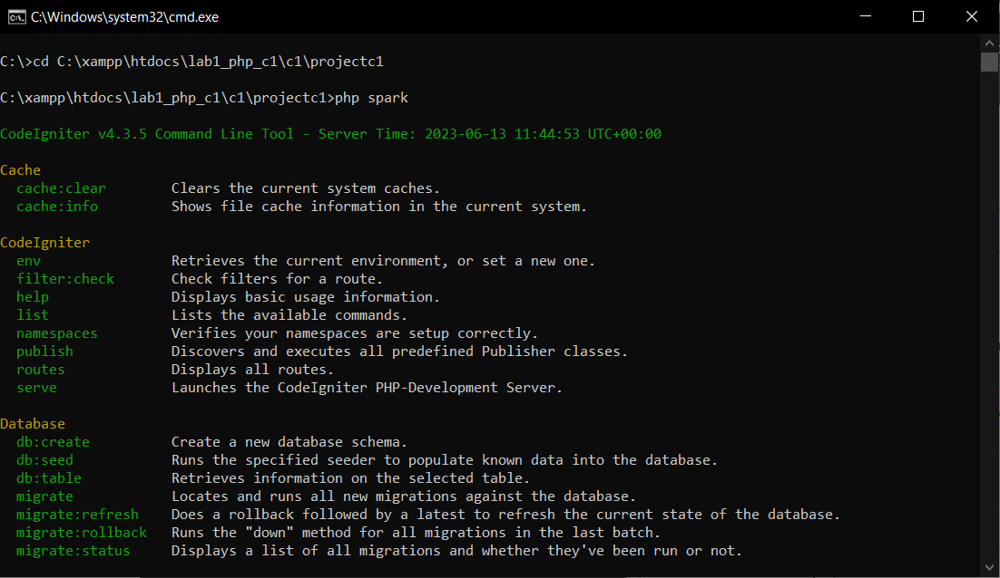
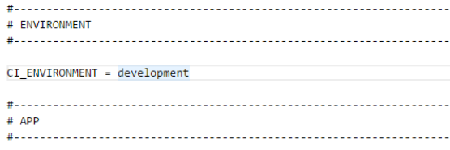
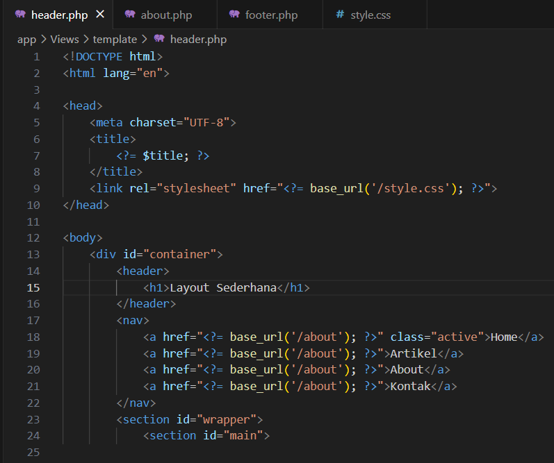
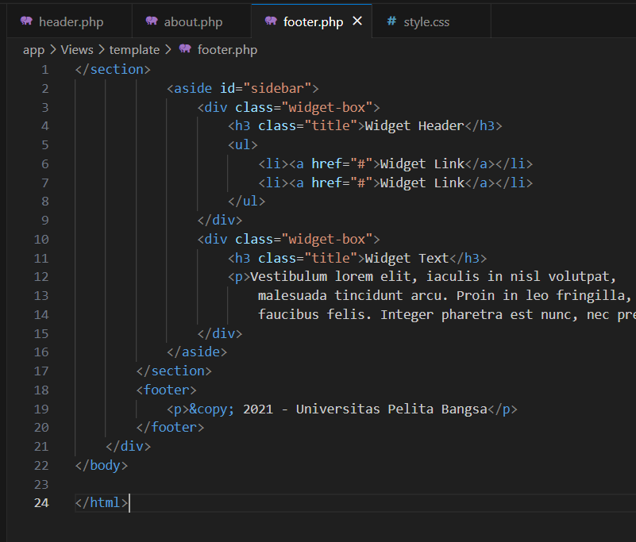
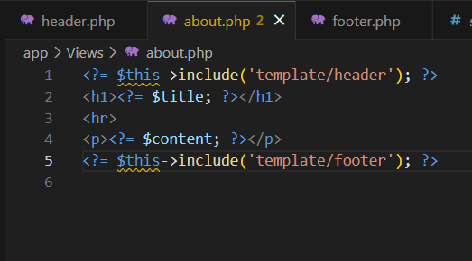
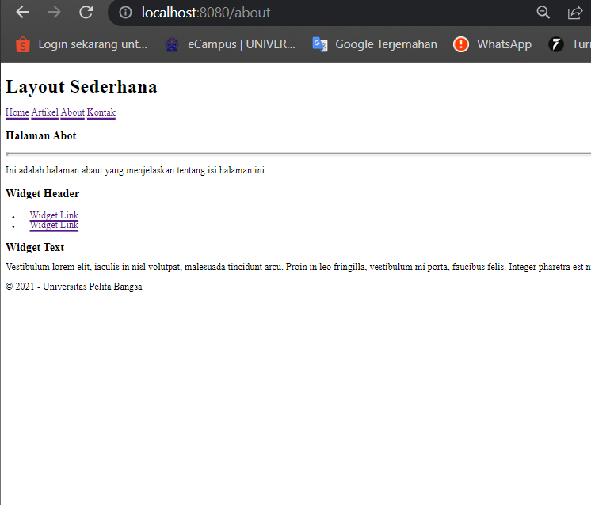

# Latihan-Praktikum-7

## Nama : Imam Solehudin
## Nim : 312110290
## Kelas : TI.21.C.1
## Mata kuliah : Pemrograman Web 2

1. Aktifkan Ekstensi
    - php-json ekstension untuk bekerja dengan JSON
    - php-mysqlnd native driver un2tuk MySQL
    - php-xml ekstension untuk bekerja dengan XML
    - php-intl ekstensi untuk membuat aplikasi multibahasa
    - libcurl (opsional), jika ingin pakai Curl
Untuk mengaktifkan ekstentsi tersebut, melalu XAMPP Control Panel, pada bagian Apache klik Config -> PHP.ini. Pada bagian extention, hilangkan tanda ; (titik koma) pada ekstensi yang akan diaktifkan kemudian simpan.

2.  Instalasi Codeigniter 4
    - Unduh Codeigniter dari website https://codeigniter.com/download
    - Extrak file zip Codeigniter ke direktori htdocs/lab11_ci.
    - Saya Ubah nama direktory framework-4.x.xx menjadi ci1.
    - Buka browser dengan alamat http://localhost/lab1_php_c1/c1/projectc1/public/

3. Menjalankan Terminal/ CMD
   Arahkan  lokasi direktori sesuai dengan direktori kerja project dibuat, ketik perintah php spark lalu php spark serve agar bisa menjalankan server lokal ini berfungsi supaya kita bisa mengakses web yang sedang kita kembangkan menggunakan codeigniter 4.
   
   
   
4. Mengaktifkan mode debugging
   Aktifkan mode debugging dengan mengubah nilai konfigurasi pada environment variable CI_ENVIRINMENT menjadi development, dan ubah nama file env menjadi .env .
 
 
 
5. Membuat Tampilan
   
   Untuk membuat view tampilan web agar lebih menarik. Buat file baru dengan nama header.php dan footer.php pada direktori view (app/view/tamplate) kemudian isi kodenya seperti berikut:

   
   Kemudian ubah file app/view/about.php seperti berikut :

Setelah itu refresh tampilan pada alamat http://localhost:8080/about :

